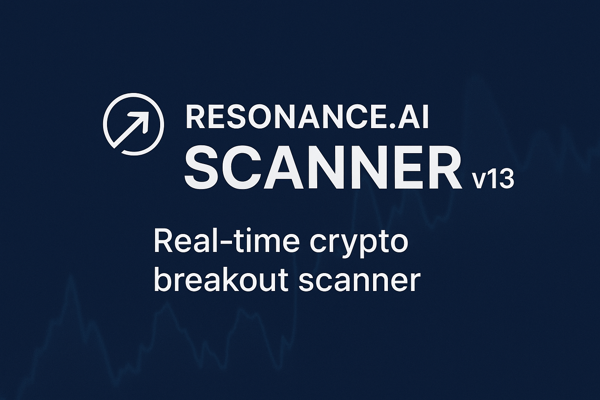

# 

---


### 📊 Badges


##  Resonance.ai-Scanner v13

**Real-time crypto breakout scanner** tailored for Coinbase. It tracks momentum shifts through advanced price and volume analytics and delivers **instant alerts to Discord**. Lightweight, open-source, and cloud-ready, this tool is perfect for traders seeking actionable insights at scale.

---

### 🚀 Features

- ⚡ **Real-time detection** of crypto breakouts using combined price & volume analytics  
- 🔔 **Discord alert integration** for immediate notification delivery  
- 🌀 **Highly efficient** and resource-conscious—great for continuous monitoring  
- 🧩 **Modular architecture**: Includes data processing, breakout detection, alerting, and visualization  
- ☁️ **Easy to deploy** on local machines or cloud services  
- 🐍 **Python-based** ecosystem (Python 3.x, pip, async-friendly design)

---

### 🛠 Quick Start

```bash
# 1. Clone the repository
git clone https://github.com/metteyyaX/resonance.ai-scannerv13.git
cd resonance.ai-scannerv13

# 2. Create and activate virtual environment
python3 -m venv venv
source venv/bin/activate

# 3. Install dependencies
pip install -r requirements.txt

# 4. Configure your webhook (example):
cp envelope.example.json envelope.json
# Edit envelope.json with your Discord webhook & parameters

# 5. Start the scanner (WebSocket mode):
python resonance_scannerv13_3_ws.py

# 6. (Optional) Run the web alert server:
python serve_detections.py

# 7. (Optional) Experiment with detection logic:
python runner.py
python top50finder_v_2_3.py

# 8. For research workflows:
python chronovore_research.py
```

---

### ⚙️ Configuration Guide

| File                  | Purpose |
|-----------------------|---------|
| `envelope.example.json` | Sample config (copy to `envelope.json`) |
| `requirements.txt`     | Python dependencies |
| `resonance_scannerv13_3_ws.py` | Core breakout detection via WebSocket |
| `serve_detections.py`  | Web alert server for HTTP integrations |
| `runner.py`            | Standalone runner logic for manual control |
| `top50finder_v_2_3.py` | Identifies top potential breakout candidates |
| `chronovore_research.py` | Experimental research workflows |

---

### ⭐ Why Use `resonance.ai-scannerv13`?

- ⚡ **Lightning-fast insights**—act on breakout detection the moment it happens.  
- 🔔 **Discord-ready** alerts keep your team or self in sync instantly.  
- ☁️ **Portable architecture**—deployable on servers, cloud VMs, or edge devices.  
- 🧩 **Open and adaptable**—extend with custom logic or integrate with BI tools.

---

### 🤝 Contributing

Found a bug? Want to suggest improvements? Please open an issue or send a pull request!  
Code contributions, feature ideas, and documentation fixes are always welcome.

---

### 📜 License

This project is licensed under the **APACHE2.0 License**. See the [LICENSE](LICENSE) file for details.

---

> _Lightweight. Real-time. Trade smarter._ 
